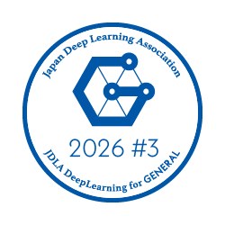
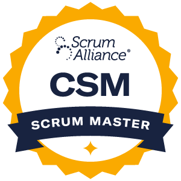

# Hi there 👋 I'm Kouhei Nishibu

<!--
**nishibu97/nishibu97** is a ✨ *special* ✨ repository because its `README.md` (this file) appears on your GitHub profile.
-->

## 🚀 About Me
- 🔭 I'm currently working on **SaaS product development** and **B to B Web application**
- 🌱 I'm currently learning **Machine Learning**, **AWS CDK**, and **Go lang**
- 💬 Ask me about **TypeScript, React, Next.js, Python, FastAPI, AWS, and LLM integration**
- 📫 How to reach me: **[nishibu.work@outlook.jp]**
- ⚡ Fun fact: I enjoy building **prototypes** and turning **ideas into reality**!

## 🎵 When I'm not coding...
- 🥁 **Music Lover** - Playing drums and discovering new artists
- ☕ **Coffee Connoisseur** - Always in search of the perfect brew
<!--
## 💼 Experience Highlights

### 🔧 **DevOps & Infrastructure**
- Implemented **CI/CD pipelines** with GitLab CI/CD
- Managed **AWS infrastructure** (EC2, S3, Lambda, RDS, CloudWatch)
- Deployed and maintained **Docker-containerized applications**

## 📈 GitHub Analytics  
📝 **Note**: These stats reflect public repositories only.  
[](https://github.com/anuraghazra/github-readme-stats)

-->

## 🚀 Current Projects
**Since October 2024**  
[Fconne](https://fts-future-connect.com/)  

**Since October 2024**  
[Le Mistral Technology, Inc.](https://www.mistral-tech.co.jp/) 

**Since August 2025**  
[ripla](https://www.ripla.co.jp/) - *Frontend Engineering*

<!--
## 🏆 コアスキル

```typescript
const mySkills = {
  得意言語: ['TypeScript', 'Python'],
  経験年数: '5年目',
  得意業務: ['設計から実装まで一貫開発', '既存システム改善', 'リファクタリング'],
  専門分野: ['Webアプリ開発', 'マイクロサービス', 'AI活用開発'],
  DevOps: ['GitLab CI/CD', 'AWS Infrastructure', 'Docker'],
  学習中: ['AWS CDK', 'Go lang', 'Team Management']
}
```
-->
## 🛠️ Tech Stack

### Frontend


### Backend


### Database & Infrastructure


### Tools & Others


## 🤖 AI & Machine Learning


**Core AI Competencies:**
*  **Amazon Bedrock / Transcribe:** コールセンター向け音声認識・文字起こし・要約パイプライン
*  **Document AI / Vision API:** 建築業界向け図面や非定型PDFからのデータ抽出
*  **Data Preprocessing:** PDF・画像データの前処理
*  **LLM Optimization:** プロンプトチューニングや精度検証と改善
*  **Proof of Concept:** ビジネス要件の仮説検証に向けたAI機能のPoC・プロトタイプ画面実装

## 🏆 Certifications

- **JDLA Deep Learning for GENERAL 2026 #3 (G検定)** — 一般社団法人 日本ディープラーニング協会 (JDLA)
- **Certified ScrumMaster® (CSM®)** — Scrum Alliance

<a href="https://www.openbadge-global.com/api/v1.0/openBadge/v2/Wallet/Public/GetAssertionShare/TzFWSW5ERm90VjNSVHR4UHA2YXhLUT09" target="_blank">
  
</a>
<a href="https://bcert.me/srmodjzad" target="_blank">
  
</a>

---

